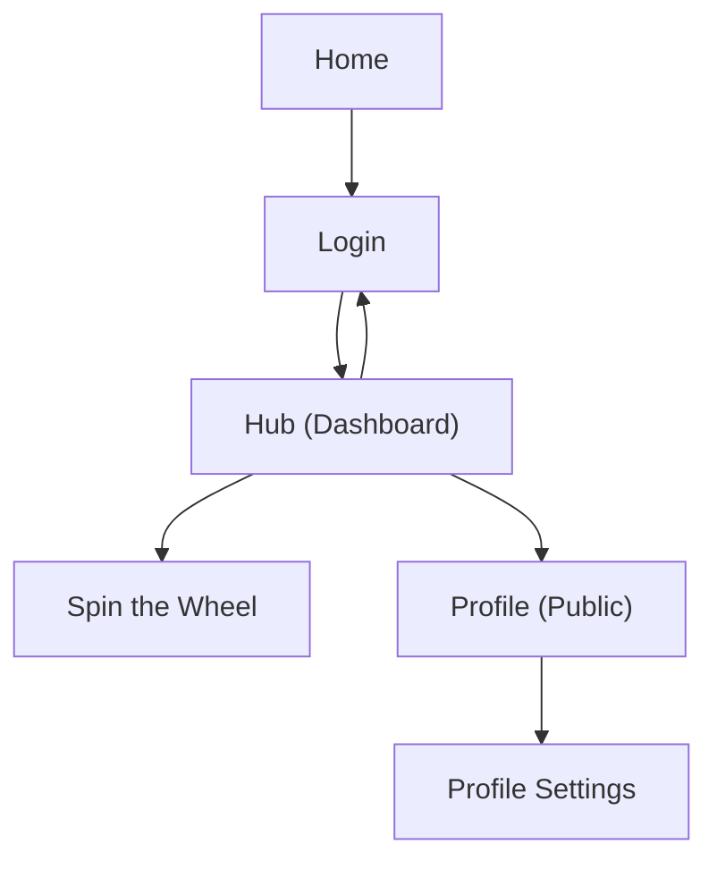

## 1. Product Overview
Clanker is a playful, expressive “community OS” web app for the Neutralen Discord.
It mixes genuinely useful community tools with social presence and a curated layer of charm/chaos.

## 2. Core Features

### 2.1 User Roles
| Role | Registration Method | Core Permissions |
|------|---------------------|------------------|
| Guest | None | Can view public pages (e.g., public profiles) where allowed |
| Member (Authenticated) | Discord OAuth login | Can access the hub shell, use tools, manage your profile/settings |

### 2.2 Feature Module
Our requirements consist of the following main pages:
1. **Home**: entry point, positioning/identity, primary CTA to log in.
2. **Login**: Discord OAuth start + error handling.
3. **Hub (Dashboard)**: community OS shell + navigation + “living” layer + module cards.
4. **Spin the Wheel**: participant input, wheel animation, team builder, saved groups, recent sessions.
5. **Profile**: public profile view and profile settings entry.
6. **Profile Settings**: manage integrations and profile preferences.

### 2.3 Page Details
| Page Name | Module Name | Feature description |
|-----------|-------------|---------------------|
| Home | Brand/identity | Present Clanker tone and “community OS” framing; route users to Login or Dashboard. |
| Login | Discord OAuth | Start Discord OAuth; show helpful errors; redirect to Dashboard when authenticated. |
| Hub (Dashboard) | App shell | Provide persistent header/nav; show identity + quick actions (theme, logout); host “living” widgets (live text). |
| Hub (Dashboard) | Module grid | Link to tools and key areas; show small “status” widgets and community cards. |
| Spin the Wheel | Wheel tool | Spin to pick winner; animate; build teams with deterministic seed option. |
| Spin the Wheel | Persistence | Create/update/delete saved groups; auto-save sessions; list and restore recent sessions. |
| Profile | Public profile | Show member identity + connected data; link to Profile Settings for the owner. |
| Profile Settings | Settings | Edit profile preferences and integration settings required by current hub features. |

## 3. Core Process
Member Flow:
1) Open Home → go to Login.
2) Complete Discord OAuth → land in Dashboard (hub shell).
3) Use navigation to open a tool (e.g., Spin the Wheel) → run actions → optionally save.
4) Open your public profile → jump into Profile Settings.
5) Logout returns you to Login.

