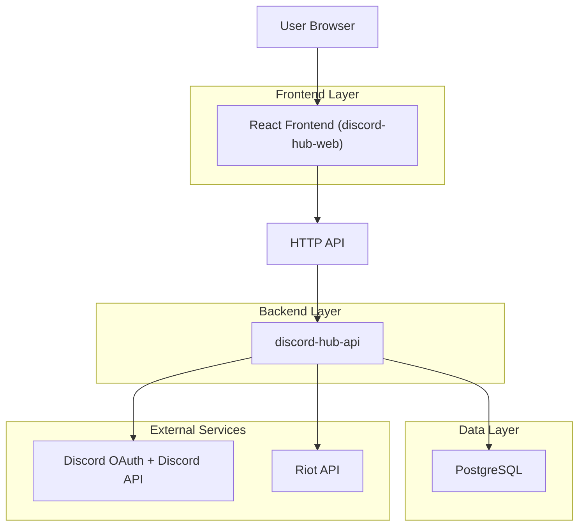
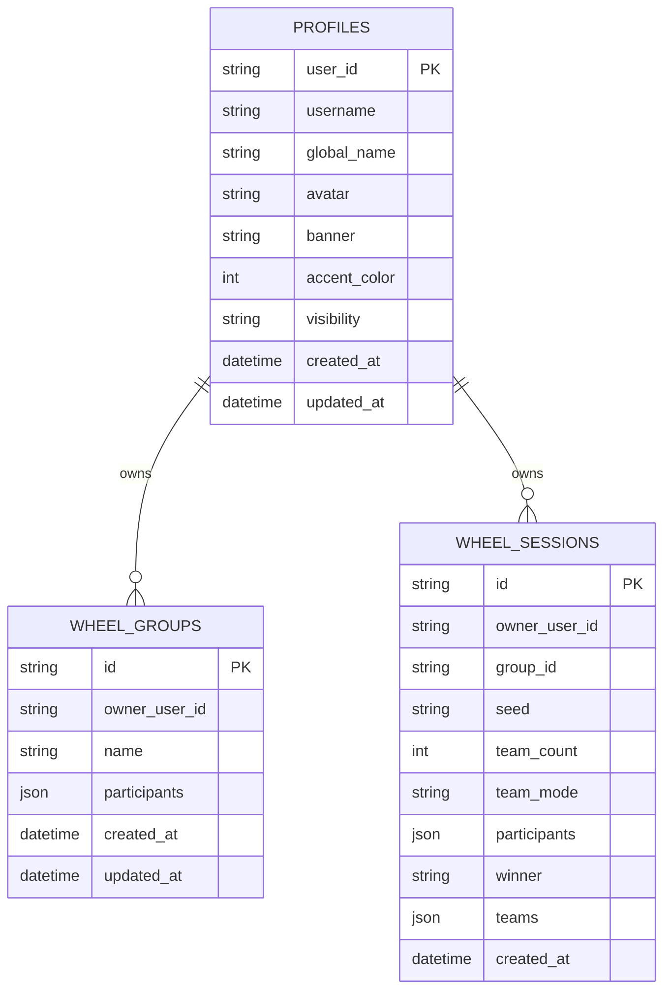

## 1.Architecture design


## 2.Technology Description
- Frontend: React + TypeScript + Vite + Tailwind CSS + shadcn/ui (via `@clanker/ui`) + Framer Motion + React Router
- Backend: Node.js + TypeScript (Hono-based HTTP app) + Zod validation
- Database: PostgreSQL (tables for profiles, league connections/snapshots, wheel groups/sessions)

## 3.Route definitions
| Route | Purpose |
|-------|---------|
| / | Home / entry point |
| /login | Discord OAuth login |
| /dashboard | Main hub shell + module cards |
| /tools/spin-the-wheel | Wheel tool + persistence |
| /u/:userId | Public profile |
| /profile/settings | Settings/integrations |

## 4.API definitions
### 4.1 Core API
Auth/session
- GET /api/auth/me
- POST /api/auth/logout

Wheel persistence
- GET /api/wheel/groups
- POST /api/wheel/groups
- PUT /api/wheel/groups/:id
- DELETE /api/wheel/groups/:id
- GET /api/wheel/sessions/recent?limit=12
- POST /api/wheel/sessions

Shared types (frontend/back)
```ts
type Profile = {
  id: string;
  username: string;
  global_name: string | null;
  avatar: string | null;
  banner: string | null;
  accent_color: number | null;
};

type WheelGroup = {
  id: string;
  name: string;
  participants: string[];
  createdAt: string;
  updatedAt: string;
};

type WheelSession = {
  id: string;
  groupId: string | null;
  seed: string | null;
  teamCount: number;
  teamMode: "balanced" | "equal";
  participants: string[];
  winner: string | null;
  teams: string[][];
  createdAt: string;
};
```

## 6.Data model(if applicable)
### 6.1 Data model definition


### 6.2 Data Definition Language
Profiles + wheel tables are already defined in migrations:
- `apps/discord-hub-api/migrations/001_init.sql`
- `apps/discord-hub-api/migrations/002_spin_the_wheel.sql`

Implementation guidance for the next UX-focused scope (no new infra):
- Keep “expressive shell” concerns frontend-only (layout, motion, live text, notifications, context menus).
- Add realtime later only where it matters (e.g., collaborative wheel) using a single WS channel + durable DB writes.