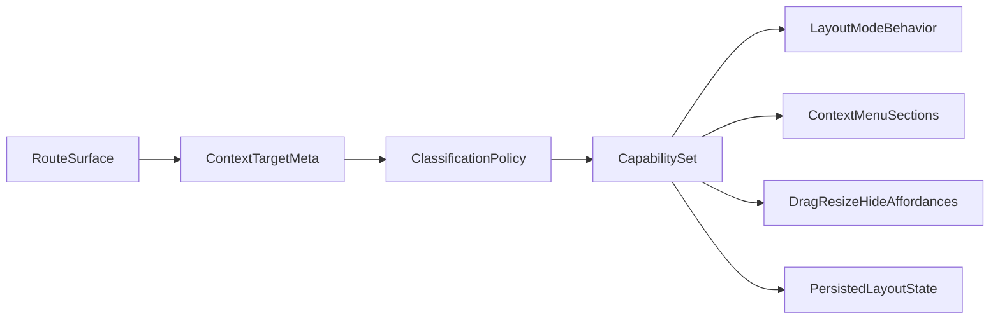

# Shell Entity Classification Architecture

This document is the source-of-truth taxonomy and policy baseline for classifying UI entities in `apps/discord-hub-web`.  
Goal: make layout mode, context menus, shell behavior, and persistence consistent across routes.

Primary code references for this baseline:
- `apps/discord-hub-web/src/lib/hub-shell-context.ts`
- `apps/discord-hub-web/src/lib/hub-shell-object-kinds.ts`
- `apps/discord-hub-web/src/lib/hub-shell-menu.ts`
- `apps/discord-hub-web/src/components/HubLayout.tsx`
- `apps/discord-hub-web/src/components/HubDesktopSurface.tsx`

## 1) Canonical Classification Model

### Category definitions

#### `ShellFixed`
Integrated shell chrome that is structurally fixed and never editable in layout mode.
- **Examples:** brand block (`shell.object` with `kind: "brandBlock"`), route panel frame chrome.
- **Intent:** preserve shell identity and navigation stability.
- **Ownership:** Shell architecture / core chrome owner.

#### `ShellReorderable`
Shell-level entities where order can change, but geometry/content editing is not allowed.
- **Examples:** primary nav item ordering inside `navGroup`.
- **Intent:** personalization of order without changing shell geometry.
- **Ownership:** Shell navigation owner.

#### `ShellConfigurable`
Shell controls configurable by settings or action toggles, but not drag/resize geometry edits.
- **Examples:** dock pins, preferences panel toggles, grid snap toggle, audio toggle.
- **Intent:** behavior/config flexibility while preserving shell frame.
- **Ownership:** Shell behavior/preferences owner.

#### `SurfaceWidget`
Surface-level dashboard/panel units that can support move/resize/hide depending on capability flags.
- **Examples:** dashboard widgets (`target.type === "widget"` in desktop surface).
- **Intent:** layout-edit manipulation on user surfaces.
- **Ownership:** Route surface owner (Dashboard, future route surfaces).

#### `SurfaceContainer`
Structural surface regions hosting content; non-hideable/non-resizable unless explicitly allowed.
- **Examples:** public profile container regions (`overview`, `league`, `steam`) rendered through surface engine.
- **Intent:** allow structure/layout semantics without treating sections as removable widgets.
- **Ownership:** Route surface owner (route-specific container model).

#### `RouteContent`
Normal route page UI controls/content that should not be interpreted as layout entities.
- **Examples:** form fields in settings/login, wheel controls, in-panel route content.
- **Intent:** keep normal app interaction separate from shell layout model.
- **Ownership:** Route feature owner.

### Ownership boundaries

- `ShellFixed`, `ShellReorderable`, `ShellConfigurable`: owned by shell/core chrome.
- `SurfaceWidget`, `SurfaceContainer`: owned by route surface modules + shared surface engine policy.
- `RouteContent`: owned by route feature teams; outside layout architecture.

## 2) Route-by-Route Classification Matrix

Columns:
- `EntityId`
- `Route`
- `CurrentTargetType`
- `Category`
- `EditableInLayout`
- `Reorderable`
- `Movable`
- `Resizable`
- `Hideable`
- `PersistenceScope`
- `Owner`

| EntityId | Route | CurrentTargetType | Category | EditableInLayout | Reorderable | Movable | Resizable | Hideable | PersistenceScope | Owner |
|---|---|---|---|---|---|---|---|---|---|---|
| `shell.brandRow` | all HubLayout routes | `shell.object(kind=brandBlock)` | `ShellFixed` | No | No | No | No | No | N/A (structural shell) | Shell core |
| `shell.nav.primary` | all HubLayout routes | `shell.object(kind=navGroup)` | `ShellReorderable` | Yes (menu/actions) | Yes (primary nav item order) | No | No | No | Local persisted nav order/bookmarks/overrides | Shell nav |
| `primary-nav-item:*` | all HubLayout routes | `navPrimary` | `ShellReorderable` | Yes (edit label/path/icon in layout mode) | Yes (via parent order list) | No | No | No | Local persisted nav order + override records | Shell nav |
| `nav-bookmark:*` | all HubLayout routes | `navBookmark` | `ShellReorderable` | Yes (add/edit/delete in layout mode) | Yes (order among nav items) | No | No | No | Local persisted bookmark records | Shell nav |
| `dock.tool:*` | all HubLayout routes | `tool` | `ShellConfigurable` | Yes (pin/unpin) | Implicit order by pinned list | No | No | No | Local persisted dock pin state | Shell prefs/config |
| `shell.identity` | all HubLayout routes | `shell.identity` | `ShellConfigurable` | No (usage-only in layout mode) | No | No | No | No | Session/profile data | Shell identity |
| `shell.surface.topbar` | all HubLayout routes | `shell.nav(area=topbar)` | `ShellFixed` | No direct geometry edit | No | No | No | No | N/A | Shell core |
| `shell.surface.desktop` | `/dashboard` | `shell.surface(area=desktop)` | `SurfaceContainer` | Yes (desktop-level layout actions) | No | No | No | No | Dashboard layout state + autosave prefs | Dashboard surface |
| `dashboard.widget:*` | `/dashboard` | `widget` | `SurfaceWidget` | Yes | No | Yes | Yes | Yes | Dashboard layout state (local+sync path) | Dashboard surface |
| `desktop.utility.spawn` | `/dashboard` | `shell.object(kind=utilityZone)` | `ShellConfigurable` | Limited (spawn/reveal actions) | No | No | No | No | Derived from hidden widget state | Dashboard surface + shell menu |
| `shell.route.panel` (`shell.route.panel-*`) | `/profile/settings`, `/tools/spin-the-wheel`, `/u/:id` | `shell.object(kind=routePanel)` | `ShellFixed` | No geometry edit; shell usage actions only | No | No | No | No | N/A (frame chrome) | Shell core |
| `shell.surface.workspace` | non-dashboard HubLayout routes | `shell.surface(area=workspace)` | `RouteContent` | No | No | No | No | No | N/A | Shell/layout boundary |
| `public-profile.container:overview` | `/u/:userId` | rendered as surface item `kind=container` (context tagged as `widget` today) | `SurfaceContainer` | Yes (via panel surface engine) | No | Yes | Yes | No | Route-local in-memory (currently no persistent write) | PublicProfile route |
| `public-profile.container:league` | `/u/:userId` | rendered as surface item `kind=container` (context tagged as `widget` today) | `SurfaceContainer` | Yes (via panel surface engine) | No | Yes | Yes | No | Route-local in-memory (currently no persistent write) | PublicProfile route |
| `public-profile.container:steam` | `/u/:userId` | rendered as surface item `kind=container` (context tagged as `widget` today) | `SurfaceContainer` | Yes (via panel surface engine) | No | Yes | Yes | No | Route-local in-memory (currently no persistent write) | PublicProfile route |
| `profile-settings.page-content` | `/profile/settings` | no hub target (normal JSX controls) | `RouteContent` | No | No | No | No | No | Feature data/API-backed settings | ProfileSettings route |
| `spin-wheel.page-content` | `/tools/spin-the-wheel` | no hub target (normal JSX controls) | `RouteContent` | No | No | No | No | No | Feature data/API + local draft | SpinTheWheel route |
| `login.page-content` | `/login` (outside HubLayout) | no shell target | `RouteContent` | No | No | No | No | No | Auth/session only | Login route |

### Notes on current gaps

- Public profile containers use `HubDesktopSurface` container semantics, but interactive context metadata still uses `target.type: "widget"` in surface cards. Policy should treat them as `SurfaceContainer`.
- Non-dashboard routes correctly lock route content interactions in layout mode through shell-level behavior, but this remains partly implicit in component-level checks.

## 3) Central Policy Contract (Docs-Only)

Future single policy API (contract only for this phase):

```ts
type ClassificationCategory =
  | "ShellFixed"
  | "ShellReorderable"
  | "ShellConfigurable"
  | "SurfaceWidget"
  | "SurfaceContainer"
  | "RouteContent";

type Classification = {
  category: ClassificationCategory;
  targetType: string;
  entityId: string;
  owner: "shell-core" | "shell-nav" | "shell-prefs" | "route-surface" | "route-feature";
  persistenceScope: string;
};

type Capabilities = {
  editableInLayout: boolean;
  reorderable: boolean;
  movable: boolean;
  resizable: boolean;
  hideable: boolean;
};

declare function classifyTarget(target: HubContextTarget, route: string): Classification;
declare function getCapabilities(classification: Classification, mode: "normal" | "layout"): Capabilities;
declare function isEditable(target: HubContextTarget, route: string, mode: "normal" | "layout"): boolean;
```

### Consolidation target

This contract should replace duplicated or implicit logic currently scattered across:
- `apps/discord-hub-web/src/components/HubLayout.tsx`
- `apps/discord-hub-web/src/components/HubDesktopSurface.tsx`
- `apps/discord-hub-web/src/lib/hub-shell-menu.ts`

## 4) WOW Workflow: "How We Classify UI"

Use this process before implementing new shell/surface behavior:

1. Add or identify the UI entity boundary.
2. Assign one canonical category in this architecture matrix.
3. Define capability flags (`editableInLayout`, `reorderable`, `movable`, `resizable`, `hideable`).
4. Register context target metadata (`hubContextData`) on the correct boundary element.
5. Verify behavior in both normal mode and layout mode.
6. Add/update i18n and menu copy where behavior or actions changed.

Guardrail rule: no new layout behavior ships without an explicit category + capability mapping entry.

## 5) Implementation Rollout Plan (Next Phase)

### Step A - Add policy module + types
- Introduce a dedicated policy module and exported types for classification and capabilities.
- Add route-aware classification mapping with stable `EntityId` conventions.

### Step B - Make `hub-shell-menu` consume policy first
- Resolve target classification through policy API.
- Build menu sections from capability outputs instead of local condition trees where possible.

### Step C - Make `HubDesktopSurface` consume policy capabilities
- Derive drag/resize/hide affordances via `getCapabilities`.
- Ensure widget vs container behavior is policy-driven, not inferred ad hoc.

### Step D - Align `HubLayout` interaction locks
- Route content lock behavior in layout mode must flow from policy (`RouteContent` / editability).
- Remove route-specific hardcoded assumptions where policy can decide.

### Step E - Remove duplicated/implicit rules
- De-duplicate old helpers/branches once policy callers are stable.
- Keep one source of truth for editability and capability decisions.

## 6) Visual Model for Alignment



## Deliverable Checklist (This Phase)

This document now includes:
- taxonomy definitions
- full route/entity matrix
- policy contract
- WOW workflow
- phased rollout plan
