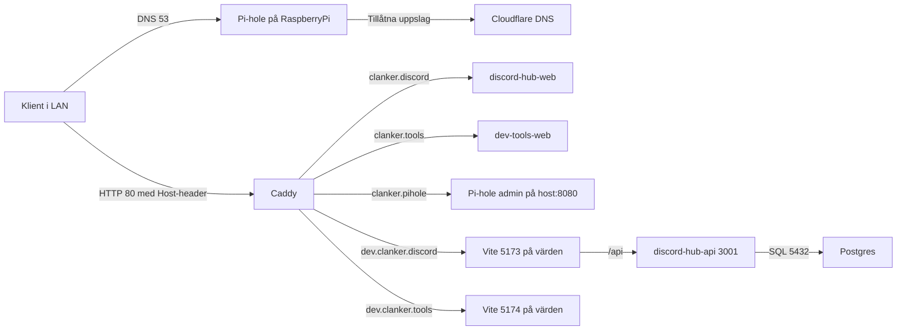

# Homelab: rundown av nuvarande nätverk

Den här genomgången beskriver hur nätet ser ut utifrån det som finns i repot och den lokala konfig som gick att verifiera. Den är skriven för att kunna delas med någon som vill förstå hur ditt homelab fungerar idag.

## Verifierat från denna PC

Det som faktiskt gick att verifiera från din PC när dokumentet togs fram:

- `docker compose ps` visar att `clanker-db` och `clanker-pihole` kör just nu.
- `clanker-pihole` är `healthy`.
- `clanker-caddy`, `discord-hub-web` och `dev-tools-web` kör inte just nu på denna maskin.
- Den levande Pi-hole-containern använder just nu `8.8.8.8` och `8.8.4.4` som upstream-DNS.
- Den levande Pi-hole-containern har `dhcp.active = false`.
- Den levande Pi-hole-containern har webbport `8080`.
- Den levande Pi-hole-containern har fortfarande `etc_dnsmasq_d = false`, så extra filer i `/etc/dnsmasq.d/` ser inte ut att vara aktiverade i nuvarande live-konfig.
- `http://192.168.0.2:8080/admin/login` svarar med HTTP `200`.
- `http://192.168.0.2:8080/admin/settings/dhcp` svarar med HTTP `200`.
- `http://clanker.pihole/admin/login` svarar också med HTTP `200`.
- `http://clanker.discord` svarar med HTTP `200`.
- `http://clanker.tools` svarar med HTTP `200`.
- `http://dev.clanker.discord` svarar med HTTP `200`.
- `http://dev.clanker.tools` svarar, men med HTTP `403`, alltså inte den förväntade app-sidan just nu.
- `192.168.0.2:22` svarar på SSH från din PC.
- Alla hostnamnen `clanker.pihole`, `clanker.discord`, `clanker.tools`, `dev.clanker.discord` och `dev.clanker.tools` resolve:ar på din PC till `127.0.0.1`.

Det här är viktigt, eftersom det finns två separata perspektiv i din miljö:

- en lokal Docker-miljö på PC:n som går att inspektera direkt med `docker exec`
- den faktiska Raspberryn i nätet, som du når via `192.168.0.2` och `clanker.pihole`
- lokala hostnamn på din PC som i praktiken resolve:ar till `127.0.0.1` och går via Caddy

För nätverksrundownen är Raspberryn och de adresser som klienterna faktiskt använder viktigast.

## Kort version

- Raspberry Pi är den centrala värden och kör Docker.
- Pi-hole kör i containern `clanker-pihole` men använder `network_mode: host`, så den lyssnar direkt på Pi:ns nätverksstack.
- Caddy kör som separat container och tar HTTP-trafik på port 80, sedan routar den vidare baserat på `Host`-header.
- Webbapparna kör normalt i Docker på port 4173 och 4174, eller via Vite i dev på 5173 och 5174.
- Postgres finns som separat Compose-tjänst och din lokala `.env` visar att den just nu är öppnad mot LAN med `POSTGRES_BIND_ADDRESS=0.0.0.0`.

## Översikt



## Delarna i nätet

### Raspberry Pi som värd

Pi:n är navet i setupen. Repots root-`docker-compose.yml` definierar:

- `clanker-pihole`
- `clanker-caddy`
- `discord-hub-web`
- `dev-tools-web`
- `clanker-db`

Pi-hole saknar Compose-profil och följer därför med i standarduppsättningen. Övriga tjänster styrs via profiler som `discord`, `devtools`, `caddy` och `db`.

### Pi-hole

Pi-hole är nätets DNS-filter och kör i containern `clanker-pihole`. Den använder host-nät, vilket innebär:

- DNS exponeras direkt på Pi:ns port 53 TCP/UDP.
- Admin-UI exponeras direkt på Pi:ns port 8080 enligt repo-konfigurationen.
- Pi-hole delar inte Docker bridge-nät med de andra tjänsterna, utan beter sig mer som en host-process.

Det gör Pi-hole lämplig som central DNS för klienterna i LAN:et.

### Pi-hole-URL:er som är verifierade från din PC

Följande adresser går till Pi-hole:

- `http://192.168.0.2:8080/admin/login`
- `http://192.168.0.2:8080/admin/settings/dhcp`
- `http://clanker.pihole/admin/login`

Tolkning:

- `192.168.0.2:8080` är den direkta adressen till Pi-hole-admin på Raspberryn.
- `clanker.pihole` resolve:ar till `127.0.0.1` på din PC och går via Caddy, men leder fortfarande till Pi-hole-admin.

### Caddy

Caddy är en ren HTTP-reverse-proxy i den här setupen. Den publicerar port 80 på värden och proxar vidare till olika upstreams beroende på vilket hostname klienten använder.

Det betyder att URL:er som `clanker.discord` och `clanker.pihole` inte är "egna tjänster" i sig, utan bara namn som Caddy matchar mot och skickar vidare till rätt backend.

### Webbappar och dev-servrar

Två huvudsakliga webbgränssnitt finns i repot:

- `discord-hub-web`
- `dev-tools-web`

De kan köras på två sätt:

- Som färdigbyggda containrar bakom nginx, publicerade på 4173 respektive 4174.
- Som Vite-devservrar på 5173 respektive 5174, där Caddy kan ge snyggare dev-URL:er via `dev.clanker.discord` och `dev.clanker.tools`.

### API och databas

`discord-hub-api` kör lokalt på port 3001 i utveckling. Vite för `discord-hub-web` proxar `/api` dit. Postgres kör som egen tjänst på port 5432.

Din lokala `.env` visar att:

- `POSTGRES_PORT=5432`
- `POSTGRES_BIND_ADDRESS=0.0.0.0`

Det innebär att databasen enligt nuvarande lokal konfig inte bara lyssnar på localhost, utan är exponerad på LAN:et. Dokumentationen säger också att detta är avsiktligt när Pi eller andra klienter ska ansluta från nätet, men då bör brandvägg begränsa åtkomsten.

## DNS: hur namnuppslag fungerar

Det avsedda flödet är:

1. En klient i nätet använder Pi:ns LAN-IP som DNS-server.
2. Pi-hole tar emot frågan på port 53.
3. Pi-hole blockerar domäner som matchar blocklistor eller släpper igenom dem.
4. Tillåtna frågor skickas vidare till upstream-DNS.
5. Svaret returneras till klienten.

Pi-hole-konfigurationen som finns i repot visar:

- Upstream DNS: `1.1.1.1` och `1.0.0.1`
- Lokal domän: `lan`
- Lokala zoner som inte ska forwardas uppströms: `lan`, `home.arpa`, `internal` och `pi.hole`

Det betyder i praktiken att lokala namn är tänkta att leva i ett separat internt namnrum, medan vanliga internetdomäner går vidare till upstream-DNS om de inte blockeras.

### Viktig skillnad mellan repo och live-container

Det checkade materialet i repot pekar på Cloudflare som upstream, men den live Pi-hole-container som kör på din PC använder just nu:

- `8.8.8.8`
- `8.8.4.4`

Så om du beskriver nuläget för någon annan bör du säga att den levande miljön just nu använder Google DNS som upstream, även om dokumentationen fortfarande beskriver Cloudflare på flera ställen.

## DHCP: vad som går att säga säkert

Det finns flera signaler här, och de säger inte exakt samma sak:

- `pihole/etc-pihole/pihole.toml` säger att Pi-holes DHCP är avstängt: `dhcp.active = false`.
- Den genererade `pihole/etc-pihole/dnsmasq.conf` innehåller fortfarande DHCP-rader med range `192.168.0.150-192.168.0.249` och router `192.168.0.1`.
- Pi-hole-UI-bilden visar att DHCP är aktiverat i den Pi-hole-instans du tittar på, med:
  - range `192.168.0.150` till `192.168.0.249`
  - router `192.168.0.1`
  - netmask automatisk
  - IPv6-stöd av
  - rapid commit av
  - advertise DNS server multiple times av
  - ignore unknown DHCP clients av

Den mest rimliga tolkningen just nu är därför:

- Repo:t visar att Pi-hole kan användas som DHCP-server.
- UI:t för den Pi-hole du faktiskt använder i nätet visar att DHCP är aktiverat.
- De checkade filerna i repo:t verkar inte helt spegla den Raspberry-instans som klienterna faktiskt pratar med.

Om du ska beskriva nuläget för din kompis är det därför bättre att säga att Pi-hole i praktiken verkar dela ut DHCP i nätet, och att DHCP-poolen enligt UI:t är `192.168.0.150-192.168.0.249` med gateway `192.168.0.1`.

### Viktig reservation om fallback-DNS

Dokumentationen beskriver en fallback-fil i `etc-dnsmasq.d/99-dhcp-dns-fallback.conf` som kan dela ut två DNS-servrar till klienter, typ:

- först Pi-hole
- sedan `1.1.1.1` som reserv

Men den checkade `pihole.toml` innehåller också:

- `misc.etc_dnsmasq_d = false`

Det betyder att extra filer i `/etc/dnsmasq.d/` enligt den här konfigurationen inte laddas automatiskt. Så repo:t dokumenterar en tänkt fallback-lösning, men den verkar inte vara aktiv i den checkade Pi-hole-konfigurationen förrän detta är påslaget eller live-miljön skiljer sig från git-versionen.

## Portar och vad de används till

| Port | Tjänst | Funktion |
| ---- | ------ | -------- |
| `53/tcp` + `53/udp` | Pi-hole | DNS för LAN-klienter |
| `80/tcp` | Caddy | Gemensam HTTP-ingång för host-baserad routing |
| `8080/tcp` | Pi-hole admin | Webb-UI direkt på Pi:n |
| `4173/tcp` | `discord-hub-web` | Prod-byggd frontend i container |
| `4174/tcp` | `dev-tools-web` | Prod-byggd frontend i container |
| `5173/tcp` | Vite | Devserver för `discord-hub-web` |
| `5174/tcp` | Vite | Devserver för `dev-tools-web` |
| `3001/tcp` | `discord-hub-api` | Lokalt API i utveckling |
| `5432/tcp` | Postgres | Databas |

## Caddy och hur URL:erna fungerar

Caddy läser `infra/caddy/Caddyfile` och matchar på hostname. Standardnamn i repo:t är:

| URL | Caddy skickar vidare till |
| --- | ------------------------- |
| `http://clanker.discord` | `discord-hub-web:80` |
| `http://clanker.tools` | `dev-tools-web:80` |
| `http://clanker.pihole` | `http://host.docker.internal:8080` |
| `http://dev.clanker.discord` | `http://host.docker.internal:5173` |
| `http://dev.clanker.tools` | `http://host.docker.internal:5174` |

Så här ska det förstås:

- `clanker.discord` och `clanker.tools` är prod-liknande namn för de byggda webbapparna.
- `clanker.pihole` är bara en proxy till Pi-holes webb-UI på hostens port 8080.
- `dev.clanker.*` är dev-namn som Caddy skickar till Vite på samma värd.

Från din PC är detta nu verifierat:

- `clanker.pihole` -> `127.0.0.1`
- `clanker.discord` -> `127.0.0.1`
- `clanker.tools` -> `127.0.0.1`
- `dev.clanker.discord` -> `127.0.0.1`
- `dev.clanker.tools` -> `127.0.0.1`

Det betyder att hostnamnen på just din PC inte pekar direkt på Raspberryns LAN-IP, utan på en lokal lyssnare som sedan proxar vidare. Headers från `curl -I` visar `Via: 1.1 Caddy`, så Caddy är faktiskt inblandad i svaren för dessa hostnamn.

Det som också är verifierat från din PC:

- `http://clanker.discord` ger `200 OK` via `nginx` bakom Caddy.
- `http://clanker.tools` ger `200 OK` via `nginx` bakom Caddy.
- `http://dev.clanker.discord` ger `200 OK` via Caddy.
- `http://dev.clanker.tools` ger `403 Forbidden` via Caddy just nu, så den adressen finns men serverar inte rätt innehåll i nuläget.

## Hur trafikflödena ser ut i praktiken

### 1. DNS för en vanlig klient

`Klient -> Pi-hole på port 53 -> block/tillåt -> Cloudflare -> svar tillbaka`

### 2. Pi-hole admin via direktadress

`Klient -> http://<pi-ip>:8080/admin -> Pi-hole webserver`

### 3. Pi-hole admin via Caddy

`Klient -> http://clanker.pihole -> Caddy -> host.docker.internal:8080 -> Pi-hole webserver`

### 3a. DHCP-inställningar direkt

`Klient -> http://192.168.0.2:8080/admin/settings/dhcp -> Pi-hole DHCP-konfiguration`

### 4. Prod-webb via Caddy

`Klient -> http://clanker.discord -> Caddy -> discord-hub-web:80`

### 5. Dev-webb via Caddy

`Klient -> http://dev.clanker.discord -> Caddy -> Vite på 5173 -> /api proxas till 3001`

## Driftkonsekvenser och beroenden

### När Pi-hole stannar

Pi-hole har ingen egen Compose-profil och ligger i samma Compose-projekt som resten. Dokumentationen är tydlig med att:

- `docker compose down` stoppar även Pi-hole
- `clanker-kill` gör samma sak om inte `CLANKER_KILL_KEEP_PIHOLE=1` är satt

Om klienterna bara har Pi:ns IP som DNS kommer internet då ofta att "se dött ut", fast själva nätet fortfarande fungerar. Det är DNS som saknas, inte nödvändigtvis internetanslutningen.

### Sekundär DNS

Dokumentationen rekommenderar sekundär DNS som fallback om Pi-hole går ner. Det förbättrar tillgängligheten, men innebär också att vissa klienter ibland kan gå förbi Pi-hole och slå upp domäner direkt mot sekundären.

### Vite bakom Caddy

När du kör dev via Caddy kan HMR behöva `VITE_HMR_CLIENT_PORT=80`, annars kan sidan bli grå eller få trasig live reload. Repo:t dokumenterar detta för både `discord-hub-web` och `dev-tools-web`.

## Säkra fakta kontra sådant som bör verifieras live

### Säkra fakta utifrån repo, lokal konfig och live-körning

- Pi-hole kör i host network och använder port 53 samt webbport 8080.
- Caddy publicerar port 80 och routar på hostname.
- Standardhostnamn är `clanker.discord`, `clanker.tools`, `clanker.pihole`, `dev.clanker.discord` och `dev.clanker.tools`.
- Repo:t beskriver Cloudflare som upstream, men den live-körande Pi-hole-containern använder just nu Google DNS.
- Lokal Pi-hole-domän är `lan`.
- Din lokala `.env` öppnar Postgres mot LAN med `POSTGRES_BIND_ADDRESS=0.0.0.0`.
- Raspberryns Pi-hole-UI visar DHCP aktiverat med range `192.168.0.150-192.168.0.249`.
- Extra `/etc/dnsmasq.d`-filer är inte aktiverade i den live-körande containern.
- `192.168.0.2` är en fungerande adress till Raspberryn för både Pi-hole-UI och SSH från din PC.
- Alla verifierade `clanker.*`-namn resolve:ar till `127.0.0.1` på din PC.
- `clanker.discord`, `clanker.tools` och `dev.clanker.discord` fungerar från din PC.
- `dev.clanker.tools` finns, men ger `403 Forbidden` i nuläget.
- `8.8.8.8:53`, `8.8.4.4:53`, `1.1.1.1:53` och `1.0.0.1:53` svarar från din PC.

### Saker som bör verifieras live innan du presenterar dem som absoluta sanningar

- Om extra filer i `etc-dnsmasq.d` verkligen används i live-miljön.
- Hur `clanker.*`-namnen sätts upp på andra klienter än just din PC, eftersom din PC nu är verifierad att använda `127.0.0.1` för dem.
- Om root-volymerna `./etc-pihole` och `./etc-dnsmasq.d` på maskinen exakt motsvarar de filer som ligger under `pihole/` i git.
- Om DNSSEC är aktivt live, eftersom docs och checkade konfigfiler inte är helt samstämmiga.
- Om den lokala Docker-Pi-hole på PC:n alls är tänkt att vara del av samma nätbild som Raspberryns Pi-hole, eller bara är en separat utvecklings-/testinstans.
- Varför `dev.clanker.tools` ger `403` i stället för appen just nu.

## Quick guide: SSH in på Raspberryn

Från din PC fungerar Raspberryn på `192.168.0.2` över SSH.

Standardkommando:

```bash
ssh <ditt-pi-användarnamn>@192.168.0.2
```

Exempel om användaren heter `pi`:

```bash
ssh pi@192.168.0.2
```

Bra att känna till:

- `192.168.0.2` är den direkta IP-adressen som också används för Pi-hole-admin på `:8080`.
- `clanker.pihole` är verifierad som HTTP-adress till Pi-hole, men på just din PC resolve:ar den till `127.0.0.1` och går via lokal Caddy.
- Dokumentet utgår från IP-adressen `192.168.0.2` för SSH eftersom det är den som är direkt verifierad för port `22`.
- Om du vill in i DHCP-inställningarna i browsern använder du `http://192.168.0.2:8080/admin/settings/dhcp`.
- Om du bara vill till login-sidan för Pi-hole fungerar både `http://192.168.0.2:8080/admin/login` och `http://clanker.pihole/admin/login`.

## Bra sammanfattning att ge till din kompis

"Pi:n är mitt nav. Pi-hole är min lokala DNS och filtrerar domänuppslag för nätet. Caddy ligger framför och gör att jag kan använda egna hostnamn som `clanker.discord` och `clanker.pihole` i stället för att komma ihåg portar. Webbapparna kan köras som färdiga Docker-containrar eller som dev-servrar via Vite. Det viktigaste beroendet är DNS: om Pi-hole stannar och klienterna bara använder den som DNS, då känns nätet trasigt fast det egentligen mest är namnuppslagningen som dör."
